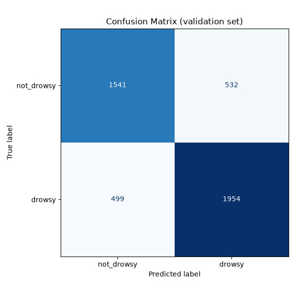
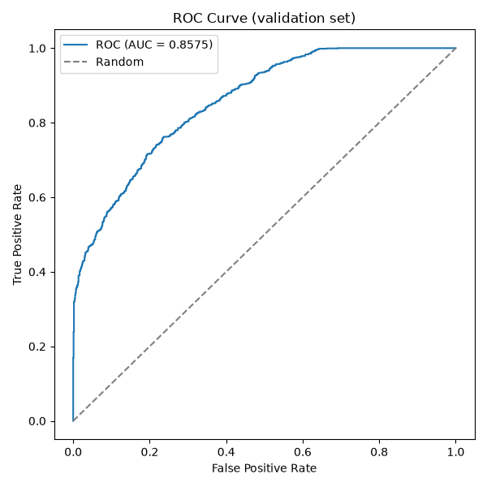
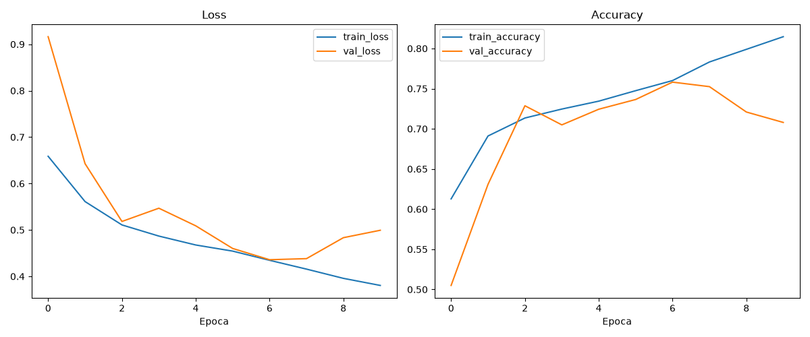

# DrowsyGuard: Secure Driver Drowsiness Detection

**Course:** Embedded Systems (Prof. Simone Romano, Prof. Giuseppe Scaniello)

---

## 1. Introduction & Motivation

Driver fatigue is one of the most common and best-documented causes of road accidents: a driver whose eyes close for even a second or two at highway speed covers a lot of ground blind. DrowsyGuard is a real-time system that watches the driver's face through a camera, decides whether they look drowsy, and reacts immediately: a local alarm goes off on the device itself, and an encrypted alert is sent over the network so the event can be logged or acted on elsewhere. Everything happens on embedded hardware, close to the driver, with no dependency on a cloud service that might be slow, unreachable, or simply not worth the added complexity for what is fundamentally a local, time-critical decision.

The system follows a layered pipeline: a sensor stage feeds a preprocessing stage, which feeds a decision stage, which drives both a local alarm and an encrypted network alert. That same shape recurs in how the project is tested and in how the security layer is built, both described later in this report.

Three constraints guided almost every design decision described in this report. The first is that the system has to run on constrained embedded hardware in real time: there is no room for a heavyweight model or a slow, blocking architecture, because a late alarm is close to a useless one. The second is that it has to be secure: any telemetry that leaves the device has to be encrypted, since an unencrypted stream saying "this driver is falling asleep" is not something to broadcast in the clear. The third, and the one that shaped the most engineering effort, is that it has to be testable. This is safety-adjacent logic: a bug in this code does not just cause a wrong answer somewhere, it can mean the alarm silently does not go off. "Trust me, it works" is not good enough for that, so every component was built to be independently verifiable without needing physical hardware in the loop.

## 2. Project Charter

Before writing any code, the goal, the scope, and the definition of "done" were fixed as a short charter, so that later decisions could be checked against something concrete instead of drifting.

| Item | Content |
|---|---|
| **Goal** | Real-time system on a Raspberry Pi (emulated) that detects drowsiness via a CNN and triggers an alarm (buzzer + encrypted MQTT) |
| **In scope** | 5 SRP components, TFLite model, mocked GPIO, AES security layer, Node-RED dashboard, adversarial attack/defense, TDD test suite, report + slides |
| **Out of scope** | Physical Raspberry Pi hardware, real camera on the Pi, cloud deployment, mobile app |
| **Platform** | Fedora + Python venv, fully emulated (except the Arduino companion, see §8) |
| **Definition of Done** | `python -m unittest` green on all components + end-to-end demo on video + report delivered |

The one addition beyond the original scope is the Arduino companion device (§8). It was not in the initial charter, but it turned out to be the only way to give the project a genuinely physical alarm, since the Raspberry Pi side stays emulated throughout by design.

## 3. Requirements (frozen baseline)

Requirements are split, in the usual way, into functional requirements (what the system does) and non-functional requirements (the properties the system has to have while doing it). Both lists were frozen early and treated as a baseline: later design decisions had to satisfy them, rather than the requirements being rewritten to match whatever got built.

**Functional:**

- FR1: acquire frames from a video source (continuous loop)
- FR2: preprocess frames (resize, color conversion, normalize 0–1)
- FR3: run CNN inference → P(drowsy) ∈ [0,1]
- FR4: smooth over an N-frame window + apply a decision threshold
- FR5: activate the buzzer (PWM/GPIO) on drowsy detection, with hysteresis (minimum alarm duration)
- FR6: publish encrypted MQTT telemetry on detection
- FR7: display an overlay (probability, FPS, alarm state)

**Non-functional:**

- NFR1: runs without physical hardware (mock import fallback)
- NFR2: encrypted telemetry (AES-CBC, confidentiality)
- NFR3: testability, meaning controllability and observability via dependency injection and mocks
- NFR4: SRP, one responsibility per component
- NFR5: resilience: the video loops when it ends, and a broker outage does not block the pipeline (async)

Two of these deserve a word of explanation because they end up shaping the whole codebase. NFR3 and NFR4 together are why the system is split into five small components instead of one large loop: a single responsibility per class is what makes each piece controllable and observable in isolation, which is what "testability" concretely means in NFR3. Section 4 shows how that plays out.

## 4. Architecture

The system is split into five components, each with a single responsibility (the SRP in NFR4, Single Responsibility Principle), wired together by dependency injection rather than by each component reaching out and constructing its own dependencies:

```
FrameProvider -> ImageProcessor -> InferenceEngine -> DrowsinessMonitor -> AlertNotifier
```

A frame's journey through this pipeline looks like this. `FrameProvider` pulls a raw frame from a video source (`cv2.VideoCapture`, which can just as well be a webcam as a video file), and loops back to the start automatically when the video ends, so the system never just stops. `ImageProcessor` takes that raw frame and turns it into the exact tensor shape and color representation the model expects: resized, color-converted, and put through the luminance transform described in §6. `InferenceEngine` wraps the TFLite interpreter and turns that tensor into a single number, P(drowsy), the model's estimated probability that the driver is drowsy in this frame. `DrowsinessMonitor` is the orchestrator that ties the other four together: it keeps a rolling window of recent probabilities, smooths them into one stable estimate, and applies the decision threshold that turns "probably drowsy" into a clean drowsy/not-drowsy decision. `AlertNotifier` is what actually does something about that decision: it drives the local buzzer through PWM/GPIO, with a minimum alarm duration so a single flickering frame does not cause the alarm to stutter on and off, and it publishes an encrypted MQTT message so the event is not just local.

Each of these five classes only knows about the interface of the thing it depends on, not a concrete implementation, and that is what dependency injection buys here. A test can hand `DrowsinessMonitor` a fake `InferenceEngine` that always returns 0.9, or a fake `FrameProvider` that never has a real camera behind it, and the component under test cannot tell the difference. This is also, concretely, what makes NFR1 possible: no physical hardware is required to run the Raspberry Pi side of this project at all. GPIO access goes through `mocks/GPIO.py`, with a `try: import RPi.GPIO / except: import mocks.GPIO` fallback used identically by every component that touches GPIO, so the exact same code path that would run on a real Pi runs happily on a laptop with no pins attached to anything.

## 5. Development Methodology (TDD)

The project was built test-first, component by component, following the usual Red, Green, Refactor cycle: write a test that fails because the behavior does not exist yet, write the minimum code to make it pass, then clean up the implementation without changing what the tests check. Every component is tested against an injected mock rather than a real dependency, mirroring the architecture in §4: `MockBuzzer` on the Arduino side, a mocked `cv2.VideoCapture`, a mocked `tflite.Interpreter`, a mocked `mqtt.Client`. This keeps the tests fast, deterministic, and runnable with no hardware or network in the loop, which matters because a test suite that needs a webcam or a live broker to pass is a test suite nobody runs often.

The result is a suite of 38 automated tests, all green: 31 Python tests using `unittest.mock`, run with `python -m unittest discover -s test`, and 7 Arduino/C++ tests written with Unity and run in PlatformIO's native environment, meaning they execute as ordinary programs on the PC rather than needing to be flashed to a board.

Beyond just passing or failing, coverage was measured with `coverage.py`, reaching 98% line coverage on `src/` (up from an initial 91%). It is worth being explicit here that a high coverage number by itself does not prove the code is correct; it only proves that most lines execute during the tests. What actually mattered was going back over the small number of uncovered lines and asking why they were uncovered, a process described in §9, which is where the number stops being decoration and starts finding real bugs.

Static analysis (flake8 and pylint) is treated the same way: as a source of concrete, checkable findings, not an afterthought. Every static-analysis claim in this report comes from actually running the tool and reading its output, not from re-reading the code and guessing what looks wrong. The full methodology and findings log is in §9.

## 6. Model Pipeline

### 6.1 Preprocessing: a deliberate detour

**Tried and abandoned: Haar-cascade eye cropping.** The initial plan, and the intuitive one, was to crop each frame down to just the eye region before feeding it to the model, on the reasoning that a tighter crop gives the network more useful pixels to work with and fewer distractions. Haar cascades are a classic, fast OpenCV technique for finding rough regions like faces or eyes in an image, and they seemed like an obvious fit here. The idea was abandoned for two concrete reasons, not a change of taste:

- On this dataset, the cascade simply failed to find an eye region in roughly 80% of samples, and even the detections it did produce were sometimes false positives, locking on to something that was not an eye at all.
- More seriously, `cv2.CascadeClassifier.detectMultiScale()` reliably segfaults when TensorFlow is imported in the same process on the training machine. This was confirmed through isolated reproduction, and it held regardless of whether `opencv-python` or `opencv-python-headless` was installed, regardless of import order, and regardless of forcing `cv2.setNumThreads(1)`. That combination of symptoms points to a real native library conflict between OpenCV's cascade code and TensorFlow's own native backend, not a fluke that a workaround would paper over.

**Final approach: no crop, no cascade, no filtering.** Every frame is used whole, resized to a fixed 96×96 square, and converted into a custom 3-channel tensor rather than the ordinary RGB image:

- **Y**: luminance, i.e. overall brightness independent of color, taken from `cv2.COLOR_RGB2YCrCb`, channel 0.
- **B**: the raw blue channel from the original RGB image.
- **R**: the raw red channel from the original RGB image.

This is not an aesthetic choice; it was forced by a real constraint on the training side. The GPU training backend in use (Intel ITEX/oneDNN) refuses to run a Conv2D layer on single-channel input, so the network needed 3 input channels no matter what. Since a convolution's parameter count depends on the number of channels, not on what is inside them, there was no cost to putting real signal in that third channel instead of a lazily duplicated copy of the luminance channel. The model ends up seeing brightness plus two real color channels, which turned out to carry enough information for the CNN in §6.2 to reach the accuracy reported in §6.3, without ever needing the fragile cascade step.

### 6.2 Model architecture

The model is a custom convolutional neural network with 341,121 parameters, comfortably under a self-imposed 2-million-parameter budget, and it is trained from scratch with no transfer learning from a larger pretrained network. This is a deliberate choice: transfer learning from a large pretrained backbone such as MobileNetV2 was considered and set aside. The reasoning is that a system meant to eventually run on constrained embedded hardware should not lean on a large general-purpose vision backbone if a small, purpose-built network can do the job; a smaller model is faster to run, smaller to ship, and easier to reason about end to end.

Training used the HuggingFace `driver-drowsiness-dataset` (a binary `drowsy`/`not_drowsy` classification task): 18,492 images for training, 2,311 for validation, and 2,313 for testing. These splits were kept strictly separate on disk and were never re-merged or reshuffled, because the source dataset already contains augmented variants of the same underlying images. Re-splitting after the fact risks a near-duplicate of a training image ending up in the test set, which would quietly inflate the reported accuracy without the model actually having learned anything more general, a classic form of data leakage.

One finding along the way was genuinely counter-intuitive. The training set has a 1.3:1 imbalance between the two classes, and the standard fix for that, passing `class_weight='balanced'` to the training loop, actually made results worse rather than better: the recall gap between classes widened from 0.61/0.89 to 0.51/0.91. The likely explanation is an interaction with early stopping, which watches validation loss to decide when to stop training; a class-weighted loss is a noisier signal for that mechanism to watch, so it tends to stop training at a worse point than an unweighted loss would. The final configuration trains with `USE_CLASS_WEIGHT = False`.

### 6.3 Results

| | precision | recall | f1-score | support |
|---|---|---|---|---|
| not_drowsy | 0.710 | 0.751 | 0.730 | 1007 |
| drowsy | 0.799 | 0.764 | 0.781 | 1304 |
| **accuracy** | | | **0.758** | 2311 |
| macro avg | 0.755 | 0.757 | 0.756 | 2311 |







The training curves show a mild overfitting onset after epoch 7, caught correctly by early stopping at epoch 10 before it could widen further. The confusion matrix and ROC curve give the same balanced picture as the precision/recall table above: errors are spread across both classes rather than concentrated in one.

Overall accuracy on the held-out test set is 75.8%, below the original 85% target set at the start of the project. This number is reported as measured, without rounding it up or leaving it out. Training was deliberately not resumed to chase a higher number; that was an explicit, time-constrained scope decision, documented again in §11 as a "will not fix" item, and not something that was simply overlooked.

What matters more than the headline number, for a system whose entire purpose is raising an alarm, is how the errors are distributed between the two classes. Precision here is, out of everything the model called "drowsy," how much actually was; recall is, out of everything that actually was drowsy, how much the model caught. A model that is very accurate only because it is extremely good at the majority class and weak on the other is a worse safety system than one with slightly lower accuracy but balanced recall across both classes, because the failure mode that matters most, missing an actually drowsy driver, is exactly what recall on the "drowsy" class measures. Here recall is 0.751 for not_drowsy and 0.764 for drowsy, close enough to each other that the model is not simply defaulting to one answer to look good on paper. That balance, more than the 75.8% figure itself, is the result this project is willing to stand behind.

## 7. Security

### 7.1 Encrypted MQTT telemetry

Detecting drowsiness locally is only half of what `AlertNotifier` does. Alongside driving the buzzer, it also publishes a telemetry message describing the event, so the alarm is not only a local beep that vanishes the moment it stops:

```
AlertNotifier -> AES-256-CBC encrypt -> Mosquitto broker -> Node-RED dashboard
```

Every payload is encrypted with AES-256-CBC (via `pycryptodome`) before it is published. CBC mode needs a fresh initialization vector (IV) for every message to stay secure, so a random IV is generated per message rather than reused; this is not just asserted, it is checked by a dedicated test, `test_encrypt_data_uses_random_iv_each_time`, that fails if two encryptions of the same payload ever produce identical ciphertext. Cross-language interoperability was verified against real payloads rather than only unit-tested in isolation: the message is encrypted in Python and decrypted in JavaScript inside Node-RED (`crypto.createDecipheriv`), with the shared AES key injected via an environment variable rather than hardcoded anywhere in the source. That end-to-end check matters because encryption bugs love to hide exactly at the boundary between two different crypto libraries' conventions, something a Python-only unit test would never catch. On the receiving side, Node-RED plus the `node-red-dashboard` package render a live gauge for P(drowsy), a status text field, and a history chart, all served at `localhost:1880/ui` alongside the Mosquitto broker via `docker-compose.yml`.

### 7.2 Adversarial attack and defense

Encrypting the channel says nothing about whether the model itself can be fooled, so a second, separate demonstration was built to show a real adversarial vulnerability against the trained model:

- **Attack:** a PGD-style (projected gradient descent) adversarial patch, a 20×20 pixel region whose pixel values are optimized over 50 steps specifically to maximize the model's loss (`epsilon=8.0` bounding how far the patch can move each pixel). Unlike a random perturbation, this patch is computed by using the model's own gradients against it, the same mechanism used to train the model in the first place, just run in the direction that makes the model wrong instead of right.
- **Defense:** Gaussian blur applied as input sanitization before the image reaches the model, which requires no retraining and no knowledge of the specific attack used.

| Stage | P(drowsy) | Correct? |
|---|---|---|
| Baseline | 0.41 | ✓ (not drowsy) |
| Patched (attack) | 0.998 | ✗ (flipped to "drowsy") |
| Sanitized (defense) | 0.48 | ✓ (restored) |

Starting from a genuinely not-drowsy sample, correctly classified at 0.41, the optimized patch pushes the model's confidence all the way to 0.998, a confident, wrong "drowsy" verdict produced from what still looks, to a human glancing at it, like an ordinary photo with a small odd patch somewhere in it. Running that same patched image through a simple Gaussian blur before classification restores the correct prediction, at 0.48. The blur is a blunt tool, and it would not survive a more sophisticated attack designed to be robust to blurring, but as a demonstration of both the vulnerability and a cheap, practical first line of defense, it makes the point clearly: a model's accuracy on clean data says nothing about its behavior under a deliberately crafted input.

## 8. Arduino Hardware Companion

Every component described so far runs entirely emulated: there is no physical Raspberry Pi anywhere in this project, and GPIO access is mocked throughout, by design (§4). That is a deliberate scope decision, not an oversight, but it does mean that without something extra, DrowsyGuard would never actually make a sound or light up an LED anywhere in the real world. To close that gap, a genuinely physical companion device was built: an Arduino Uno R4 WiFi that subscribes to the same encrypted MQTT topic `AlertNotifier` publishes to, and reacts to it on real hardware, independent of whether the Raspberry Pi side is emulated or not. This also mirrors how a real deployment would likely work: the perception and decision logic lives on a more capable device, while the actual alarm hardware is a small, cheap, dedicated microcontroller.

It is worth being explicit about a design choice that can look redundant at first glance: `AlertNotifier` still drives a Pi-side GPIO buzzer through PWM (§4, §7.1) even though the Arduino is the device that actually produces a physical alarm. This is intentional, not leftover code from before the Arduino existed. The Pi-side buzzer path exists to satisfy the course's own requirement of demonstrating GPIO control on the Raspberry Pi directly, independent of any other device on the network. The Arduino path exists to demonstrate what a real deployment would look like, with the alarm hardware living on its own dedicated microcontroller rather than wired straight into the perception device. The two paths serve two different purposes and were designed together, not one on top of the other.

Keeping both also buys more than just satisfying two requirements at once. Because the Raspberry Pi and the Arduino only ever talk to each other through the encrypted MQTT message contract, the two sides are genuinely decoupled, not just physically separate. The Raspberry Pi can run entirely on its own, with only the local GPIO buzzer as its alarm, in a deployment that has no Arduino at all. Going the other way, the system's actuation behavior can be extended by touching only the Arduino firmware: a different alarm pattern, an additional actuator such as a dashboard light or a seatbelt vibration motor, or a second board reacting to the same feed, are all changes that live entirely on the Arduino side and require zero changes to the Raspberry Pi or the model pipeline. The Arduino, from its own point of view, treats the Raspberry Pi as a black box that produces a feed of encrypted detection events; it does not need to know anything about the camera, the preprocessing, or the model to decide what to actuate. That is a clean, easily reachable separation between the perception and decision role and the actuation role. It also means the two sides can use whatever language and platform fits their own hardware, Python on a capable single-board computer for the model, C++ on a constrained microcontroller for the actuator, without either side having to compromise for the other. And because the Arduino only ever receives data, never sends anything back that could reach the camera or the model, compromising the actuator device does not by itself expose the perception pipeline, which is roughly how a real commercial driver-monitoring product would want the trust boundary drawn between a sensor unit and an alert unit.

That same decoupling is also where a real, currently unresolved limitation shows up. The protocol between the two sides is master/slave: the Raspberry Pi publishes when it detects drowsiness, and the Arduino only ever reacts, with no acknowledgment sent back and no periodic "I am still alive" message from either side. That means neither side has any way to notice if the other one has stopped working. If the Raspberry Pi's process crashes, the camera fails, or the network drops, the Arduino simply stops receiving messages and its alarm times out and turns off, which looks identical to genuinely having no drowsy driver to report. If the Arduino itself loses power or resets, the Raspberry Pi keeps publishing exactly as before, with nothing telling it that its alerts are going nowhere. This was discussed directly during development as a possible three-state protocol, publishing on every decision instead of only on a drowsy transition, with a timeout on the Arduino side to detect a silent Raspberry Pi, but it was deliberately not implemented, for the same time-budget reasons documented in §11. It is recorded here as a known gap rather than something that was missed: a real driver-monitoring product would need some form of heartbeat or liveness check between the two sides before either side's silence could safely be trusted as "nothing to report."

```
MQTT receive -> AES-256-CBC decrypt (on-device) -> TelemetryHandler -> alarm
```

The board decrypts the payload itself, on-device, using `tiny-AES-c`, a small vendored AES implementation forced into AES-256 mode via a `-DAES256=1` build flag (its default is AES-128, which would not match the 256-bit key used everywhere else in the project). `TelemetryHandler` is the C++ counterpart to `AlertNotifier.notify()`'s hysteresis logic, adapted to a real constraint of the protocol: the Arduino only ever receives "alarm start" MQTT messages, since the Python side never publishes an explicit "stop" message (see §7.1). Because of that, the handler cannot wait for a stop signal that will never come; instead it times itself out via `update()`, which is polled continuously in the main loop and turns the alarm off once enough time has passed since the last "start" message. Alongside the real buzzer, `RealBuzzer::start()`/`stop()` also drive the board's built-in 12×8 monochrome LED matrix (all on, or clear) as an additional visual indicator. It is not a substitute for the buzzer, the two fire together; the matrix was added simply because the board already has it on-board at no extra hardware cost, giving a second, unmistakable confirmation of the alarm state alongside the sound. The firmware ships with two PlatformIO environments: `native`, which runs the Unity test suite on the PC with no hardware involved at all, and `uno_r4_wifi`, which targets the real board (`renesas-ra` platform, using WiFiS3 and ArduinoMqttClient).

### 8.1 Three real bugs, found only on real hardware

None of the three bugs below showed up anywhere in the unit test suite. All three only became visible once the system actually ran end to end on physical hardware, over a real WiFi network, talking to a real broker, and each one is a different flavor of problem that a mocked test simply has no way to see.

1. **Wrong WiFi SSID.** This one was purely a configuration mistake, but finding it required adding a temporary `WiFi.scanNetworks()` dump to `main.cpp` to list every network the board could actually see, because before that the board had zero serial output at all. No logging of any kind existed on the firmware, so debugging was completely blind until that logging was added; the lesson here is less about the SSID itself and more about how much harder every subsequent bug was to find before there was any visibility into what the board was doing.
2. **LED matrix never lit**, despite the logs confirming that MQTT reception, AES decryption, and `TelemetryHandler` were all working correctly. The root cause turned out to be a subtle one: `RealBuzzer` is declared as a file-scope global object, so its C++ constructor runs during static initialization, which on this board happens before the board's own `init()` routine has configured clocks and peripherals. `ArduinoLEDMatrix::begin()` needs to allocate a hardware timer for the interrupt that refreshes the LED matrix, and calling it that early makes the allocation fail silently: `loadFrame()` still returns successfully, as far as the software is concerned, but nothing physically lights up, and nothing anywhere reports an error. The fix was to move all hardware initialization out of the constructor and into an explicit `begin()` method, called from `setup()` once the board's own initialization has actually finished.
3. **Model never triggered on live webcam**, even with eyes fully closed in front of the camera. The root cause here was a mismatch between two pipelines that had quietly drifted apart: live inference was feeding the model plain, normalized RGB frames, while the model itself had been trained on the Y/B/R transform described in §6.1. This is exactly the kind of bug that unit tests cannot catch by construction, since no test in the suite ever exercises a real camera frame end to end through both the live preprocessing code and the trained model together. The fix was to bring `ImageProcessor` in line with training by adding the same Y/B/R transform to the live pipeline.

### 8.2 End-to-end verification and a known limitation

With those three fixes in place, the full loop was verified running live: a webcam feed goes through the smoothing and threshold logic, out as an encrypted MQTT message, across the network, and into the physical Arduino, whose LED matrix lights up correctly on detection.

**Known limitation, documented here as a deployment constraint rather than a bug:** the model only reacts reliably when the driver's face fills most of the camera frame. This was confirmed empirically rather than assumed: close to the camera, detection works as expected; at a normal webcam distance, the model's confidence stays flat around 0.10 to 0.14 regardless of the driver's actual state, essentially insensitive to what is happening in the frame. The root cause traces back to the training data itself, which consists of close-up face crops; at the 96×96 resolution the model was trained on, a small or distant face in the frame simply does not contain enough eye detail left to work with. Adding automatic face-cropping to fix this at inference time was deliberately not attempted, because that exact path was already tried and abandoned during training for the TensorFlow/cascade segfault reason described in §6.1, and the same native library conflict risk applies here too, since `InferenceEngine` still imports `tensorflow.lite` in the same process. Instead, this is documented plainly as a hardware constraint: DrowsyGuard is designed around a dashboard-mounted, close-range camera, the way a real driver-monitoring system would be installed, not a general-purpose webcam sitting somewhere across the room.

## 9. Testing & Quality Assurance

### 9.1 Coverage-driven bug hunt

The TDD suite built alongside each component (§5) answers "does the code I wrote do what I meant it to do." It does not automatically answer a related but different question: how much of the code actually gets exercised by the tests, and what happens on the paths that do not? Late in the project, a dedicated review pass was done specifically to answer that second question. `coverage.py` was installed to get real numbers instead of guessing, and rather than treating the coverage percentage as a target to mechanically close, every single uncovered line was read individually and reasoned about: was this genuinely a gap worth closing, or an acceptable limitation?

The result was that line coverage on `src/` went from 91% to 98%, and the new tests written to close that gap closed real, previously silent behavioral holes:

- `AlarmState`'s hysteresis logic was only tested for "enough time has passed, so clear the alarm." The symmetric case, that the alarm should stay active when not enough time has passed yet, was untested; a regression there could have made the alarm flicker off too early with nothing catching it.
- `notify(drowsy_detected=False)` when the alarm had never been triggered in the first place, a very ordinary case in practice (the system starts up and the driver is simply never drowsy during the whole session), was untested.
- `_on_connect`/`_on_disconnect`, the paho-mqtt connection callbacks, were at 0% coverage. The MQTT client is mocked everywhere else in the test suite, so these two callbacks were registered with the library but never actually invoked by any test, meaning nothing verified that `_connected` gets updated correctly against the real callback contract, where `rc == 0` means success and anything else means failure.
- The `publish_via_mqtt` guard that skips publishing when the client is not connected was untested, so nothing actually proved that the local alarm still fires correctly while the broker happens to be unreachable, which is exactly the situation NFR5 asks the system to tolerate.
- `FrameProvider`'s double-read-failure edge case, where the video ends, a rewind is attempted, and the rewind itself also fails to produce a frame, was untested.
- The interactive 'q'-to-quit key path in `DrowsinessMonitor.run()`, used for local debugging, was untested.

One gap was left open on purpose rather than closed: the branch of the code that runs when `import RPi.GPIO` actually succeeds (`GPIO_MOCK = False`) cannot be exercised at all without physical Raspberry Pi hardware, which this project deliberately does not have. That is accepted as an intrinsic limitation of the emulated-hardware approach described in §4, not a process failure to be fixed later.

This review did more than just raise the coverage percentage; it surfaced two real bugs that had nothing to do with the number itself.

1. **`AlertNotifier.cleanup()` was never called anywhere in production code.** The method exists, and does exactly what it should: it stops the buzzer, releases the GPIO pins, and stops the MQTT client's background loop. But `DrowsinessMonitor._cleanup()`, the only place that runs when the video source ends, only ever called `cv2.destroyAllWindows()`. On real hardware this meant GPIO pins were never actually released on shutdown, a real resource leak that no amount of "the code compiles and the demo works" would ever reveal. This was proven, not just suspected, with a failing test (`AssertionError: Expected 'cleanup' to have been called once. Called 0 times.`) before the one-line fix, adding the missing call, was applied.
2. **Arduino `TelemetryHandler::onMessage()` crashed on malformed input.** The line `const char* status = jdoc["status"];` returns a null pointer when the JSON is otherwise valid but simply does not contain a `status` key, and the following call, `strncmp(status, ...)`, is undefined behavior when handed a null pointer. In normal operation this path is never reached, because the Python side always includes `status` in every message it sends, but it is a real robustness gap against any malformed or corrupted input that manages to reach the decrypt step. This was not left as a theoretical worry: it was reproduced as an actual SIGSEGV, a real segmentation fault crashing the native test build, before a simple null-check fix was applied and verified to resolve it.

### 9.2 Static analysis and refactoring

flake8 reports zero issues on `src/`. pylint found one real, substantive finding rather than a cosmetic one: `AlertNotifier` had too many instance attributes (`R0902`, 10 attributes against a threshold of 7), a classic early warning sign that a class is quietly doing more than one job. This was resolved by extracting two collaborator classes via composition, so that `AlertNotifier` delegates instead of holding everything directly:

- `AlarmState`: the alarm's start/stop hysteresis logic, pulled out because it is genuinely its own cohesive, independently testable piece of behavior, not just a convenient place to dump some fields.
- `MqttConfig`: a lightweight value object that simply groups the MQTT connection parameters together.

That refactor brought `AlertNotifier` down from 10 attributes to 6, resolving the finding, and the file's pylint score in isolation went to 8.55/10 afterward.

A related class, `DrowsinessMonitor`, triggers the exact same `R0902` warning (8 attributes, only 1 over the threshold) and was deliberately left unrefactored. That is a conscious decision, not an inconsistency: of those 8 attributes, 4 are already-correct dependency-injected collaborators (`frame_provider`, `image_processor`, `inference_engine`, `alert_notifier`), each one already living in its own class with its own single responsibility and its own mock-based test suite, exactly as §4 describes. pylint's attribute count has no way to distinguish "this class holds references to its injected dependencies" from "this class is hoarding real internal state," and in this case it is clearly the former. Splitting `DrowsinessMonitor` further to satisfy the linter would only have quieted the tool, at the cost of extra indirection for no real gain in cohesion, which is a worse outcome than living with a warning that does not actually point at a problem.

Every static analysis finding across the project's history, going back to the very first commit, is logged with what was found, which tool found it, and who applied the fix; the full commit-by-commit log lives in `IMPLEMENTATION_PLAN.md` §8. One gap in that process is acknowledged rather than hidden: `test/*.py` was never itself brought to flake8 compliance the way `src/` was. 22 pre-existing findings there, mostly long lines, were identified and left unaddressed, flagged explicitly rather than silently ignored, as a separate task that simply did not fit in this project's time budget.

## 10. Use of AI in This Project

This project was built collaboratively with an AI assistant, and this section exists to be specific about exactly what that collaboration involved, rather than leaving "AI-assisted" as a vague label. One rule was kept consistent throughout: the assistant never wrote `src/*.py` or the tested Arduino core logic directly. That code, the graded implementation, is mine. Within that boundary, the assistant's role broke down as follows:

- **Planning help**: structuring an effective work plan.
- **Autonomous**: reviewing the tests.
- **Autonomous**: reviewing code smells and other static-analysis tool findings.
- **Autonomous for low-hanging fruit, manual for complex cases**: patching findings. Mechanical fixes, dead imports, formatting, missing newlines, were applied directly by the assistant; anything involving a real design decision, such as the `AlertNotifier` composition refactor in §9.2 or the Arduino null-check fix in §8.1, was implemented by hand, by me, after the assistant identified the issue and explained why it mattered.
- **Autonomous**: writing commits and pushing after a prompt, and updating progress documentation (`IMPLEMENTATION_PLAN.md`) to reflect completed steps.
- **Autonomous**: reviewing code to find hidden bugs and untested edge cases, with a subsequent suggestion of the tests needed to close those gaps. Section 9.1 is the direct, concrete result of this: both bugs described there were found this way.

Here, *autonomous* means the assistant did the work itself after a prompt, without me supervising it step by step, and *manual* means I did the work myself, after the assistant pointed out what needed doing. A narrower, explicit exception to the "assistant never writes graded code" rule applies to scripts and tools outside the graded test suite: `train_model.py`, `prepare_dataset.py`, `security/adversarial_patch.py`, `main.py`, and the hardware smoke-test tooling were all written directly by the assistant, since none of them are part of what is being evaluated as the tested implementation.

## 11. Deliberate Technical Debt

Everything listed in this section is a conscious, scoped decision made under real time constraints, not something that was simply missed. It is written down explicitly here so that it reads as "known and accepted," rather than leaving a reader to wonder whether it was noticed at all.

- **Missing docstrings.** pylint reports 21 real findings (`C0114`/`C0115`/`C0116`, missing module, class, and function docstrings) across `src/*.py` and `main.py`, confirmed by actually running `pylint src/ main.py`. These were left unaddressed on purpose: this project is already documented extensively at the architecture and decision level, in this report, in the implementation plan, and in inline comments that explain why something is done a particular way rather than what it does, which well-named functions and classes already communicate on their own. Writing a docstring on every method with an already self-explanatory name would have added boilerplate, not new information. The time that would have taken went instead into the coverage-driven review in §9.1, which found two real bugs; that felt like the better use of a limited amount of remaining time.
- **Model accuracy (75.8%, target was >85%): will not fix.** Training was paused at a deliberate checkpoint, and resuming it to chase a higher number was judged not worth the remaining time available. The result is reported as measured in §6.3, not hidden or rounded up.
- **Recorded demo video clips: will not fix.** The project's frozen Definition of Done (§2) asks for an end-to-end demo on video, and that is already satisfied by the live webcam-to-Arduino run described in §8.2. A separately recorded clip would only add supporting evidence for a presentation; it would not close any actual requirement gap, and was judged not worth the remaining time either.
- **`test/*.py` flake8 compliance**: 22 pre-existing findings, discussed in §9.2, flagged but not fixed.
- **Physical Raspberry Pi hardware and a real `secrets.h`/camera deployment**: explicitly out of scope for this project from the very start, as stated in the charter in §2. Only the Arduino companion was ever targeted at real hardware, and that hardware bring-up, described in §8, was completed and verified.
- **No heartbeat between the Raspberry Pi and the Arduino** (§8): the master/slave MQTT protocol has no liveness check in either direction, so a crash on one side is indistinguishable from "nothing to report" on the other. A three-state protocol with a timeout-based liveness check was discussed and deliberately not implemented, for the same time-budget reasons as the rest of this section.

## 12. Conclusion

DrowsyGuard, as delivered, is a complete, tested, secure driver-drowsiness detection pipeline: five single-responsibility components built test-first, a lightweight custom CNN whose results are reported honestly rather than polished, AES-256-CBC encrypted telemetry with both a demonstrated adversarial attack and a working defense against it, and a physical Arduino companion that surfaced three real hardware bugs no unit test could ever have caught on its own. A later, deliberate coverage-driven review of the test suite itself, taking `src/` from 91% to 98% line coverage, found two further real bugs on top of that, one of them reproduced as an actual crash rather than argued about in the abstract. What remains open at the end of this project is reported the same way everything else is: transparently. A below-target model accuracy, accepted under real time constraints, and a small, explicitly scoped set of "will not fix" items, rather than anything left quietly unmentioned.
